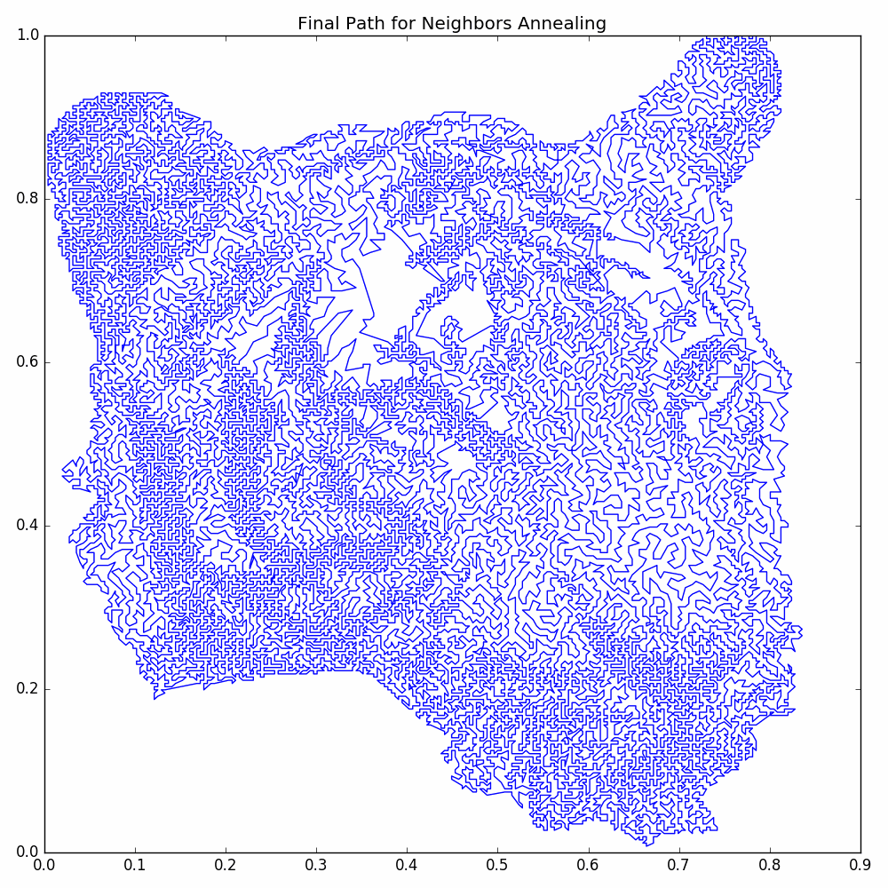

You may also consult the [Project Page](https://matthewmcgonagle.github.io/TSP_PictureMaker/) and the 
[Interactive Session Tutorial](https://matthewmcgonagle.github.io/TSP_PictureMaker/tutorial.html).

# What is TSP_PictureMaker?
`TSP_PictureMaker` is a module library for converting a picture to a a depiction created by an approximate solution
to the Travelling Salesman Problem (TSP). As an example, the code in `example.py` takes the following picture of a tiger's head:

and converts it to the following picture

The process to make the final picture are as follows:
1. The vertices for the TSP are created by dithering the input image and using the result black pixels as vertices.
2. An intial greedy guess for the solution to the TSP is made.
3. The greedy guess is improved by applying a modification of simulated annealing that is based on a decaying 
size scale.
4. Further improvements are made by applying another modification of simulated annealing based on nearest neighbors. 

# Example Code

## example.py

An example of using the functions to convert tigerHeadResize.png into a TSP picture.

# Package Description 

The name of the package is `tspDraw`. It contains the following modules:

## dithering

Class and functions for applying dithering to an image.

## graphics

Functions for plotting results, saving images, and preprocessing of input images.

## jobs

Functions for dealing with running batches of the annealing steps for different types of annealers.

## neighbors

Contains annealer that uses k-nearest neighbors as vertex pool.

## processVertices

Functions for getting the vertices from the dithered image and for preprocessing them, including the
initial greedy guess. 

## sizeScale

Contains annealer that uses a vertex pool based on a lower bound of the distance to the either of
the vertex's initial neighbors in the initial cycle. 

# Description of Library's Process

For a discussion of how the process works, please see [this blog post by Matthew McGonagle](https://matthewmcgonagle.github.io/blog/2018/06/09/TSPArtModifiedAnnealing).
