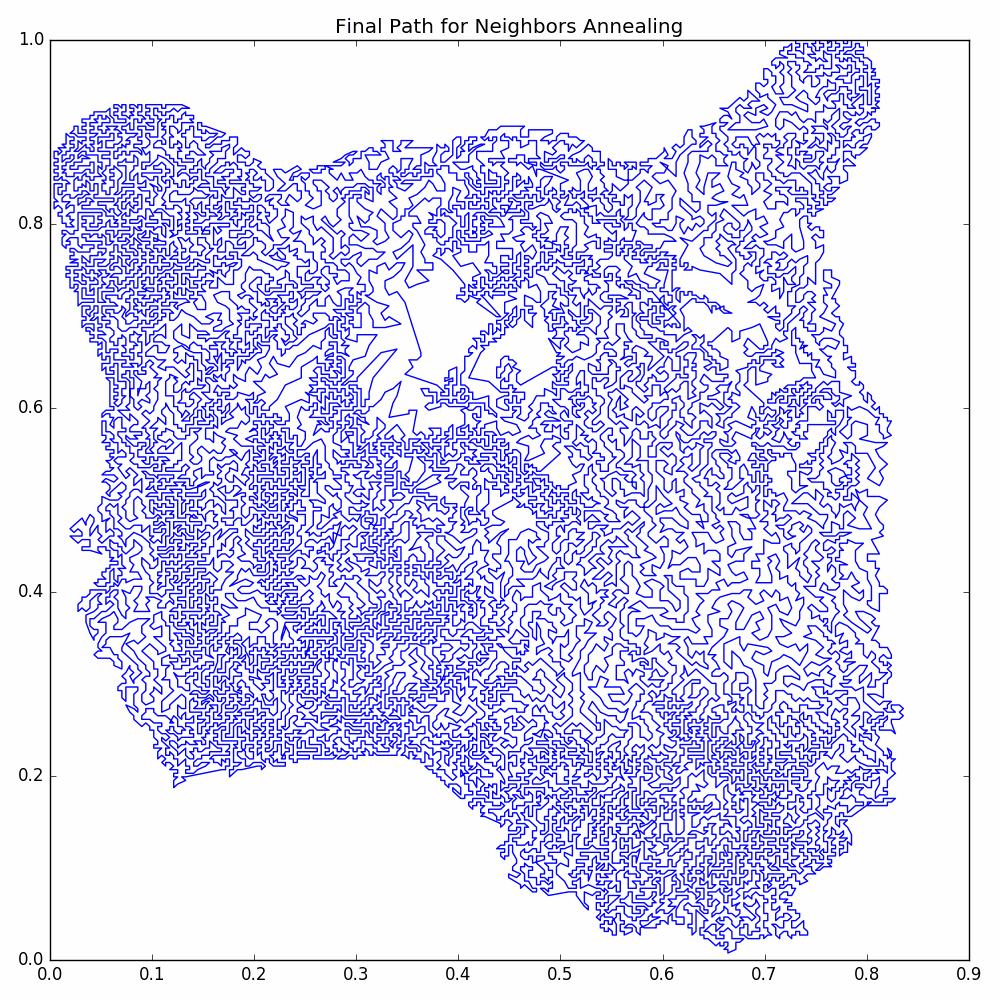

`TSP_PictureMaker` is a `python` module for making a version of an image using a curve with a minimal
number of self-intersections that is found by approximating a solution to the Travelling Salesman Problem (TSP).
As an example, the following picture:

was made from the following original picture:

# Using `TSP_PictureMaker` 

The easiest way to use `TSP_PictureMaker` is to use it as an interactive session. The API for the
interactive session is `tspDraw.interactive.py`. An example of how to use the interactive session 
is provided by `exampleInteractive.py` in the project root directory. For help understanding how to
use this, please see the [Using the Interactive Session Tutorial](tutorial.html).

# API

